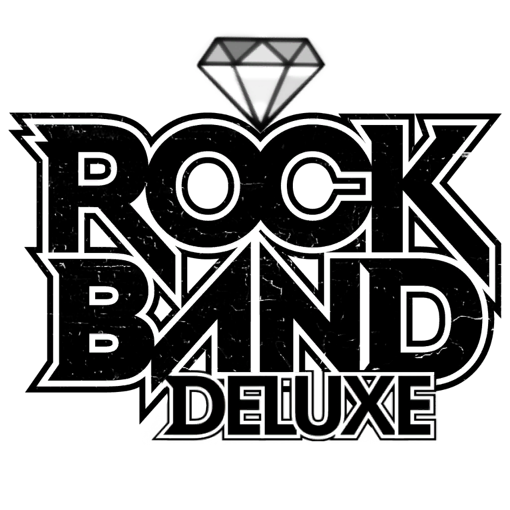

# Rock-Band-1-Deluxe

## Introduction

This Repo contains everything you need to build an ark for Rock Band 1 Deluxe for Xbox 360.

## Install

NOTE: You WILL need a modded/hacked console to play this mod on console. I hope this is clear

Setting up the Rock Band 1 Deluxe repo for the first time is meant to be as easy as possible.
As well, it is designed to allow you to automatically receive updates as the repo is updated.

Simply go to the Releases of this repo and grab all three files. (two .exe, one .bat)

The two exe's are a couple dependencies, [Git for Windows](https://gitforwindows.org/), and [Dot Net 6.0 Runtime](https://dotnet.microsoft.com/en-us/download/dotnet/6.0/runtime).
Git is required for you to take advantage of auto updating via github pulls. Dot Net is required to build an ARK file, the archive format the game needs to run.
You can setup git with all default options, same with dot net.

Once the dependencies are installed, run `_init_repo.bat` in an **empty folder**. git will pull the repo and make sure you are completely up to date.

Copy your base game Rock Band 1 main.hdr and ark files to `_build/Xbox/gen`.

From then on simply run `_build_xbox.bat`. This script will pull the repo again for updates, and build the ARK for you and spit it out in `_build/Xbox`

Then copy the gen folder and the xex from `_build/xbox/` to the location you have installed Rock Band 1. Subsequent copies only require `main.hdr` and `main_2.ark` from `_build/Xbox/gen` to be copied

Make sure you clear your system cache.

To clear system cache, navigate to Storage, and press Y to clear the system cache.

If installing for the first time, make sure you rename the vanilla `default.xex` to `default_vanilla.xex` for safety.

Also make sure to disable any enabled updates for Rock Band 1 in Aurora. Rock Band 1 deluxe rolls TU5 into its base installation.

Run the build script again to pull any new updates committed to the repo and rebuild a new ark.

## Songs

You can find song packs compatible with all Rock Band titles on the [Spreadsheet](https://docs.google.com/spreadsheets/d/1-3lo2ASxM-3yVr_JH14F7-Lc1v2_FcS5Rv_yDCANEmk/edit#gid=0).

You can also use [Onyx Music Game Toolkit](https://github.com/mtolly/onyxite-customs) to generate your own custom song packs for Rock Band games.

## Included Dependencies

[Git for Windows](https://gitforwindows.org/) - CLI application to allow auto updating rb1dx repo files

[Dot Net 6.0 Runtime](https://dotnet.microsoft.com/en-us/download/dotnet/6.0/runtime) - Needed to run ArkHelper

[Mackiloha](https://github.com/PikminGuts92/Mackiloha) - ArkHelper for building Rock Band 1 ARK - Superfreq for editing milo files

[dtab](https://github.com/mtolly/dtab) - For serializing Rock Band dtb files
